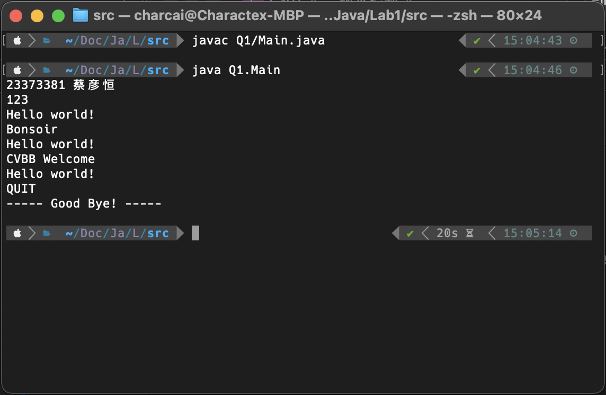
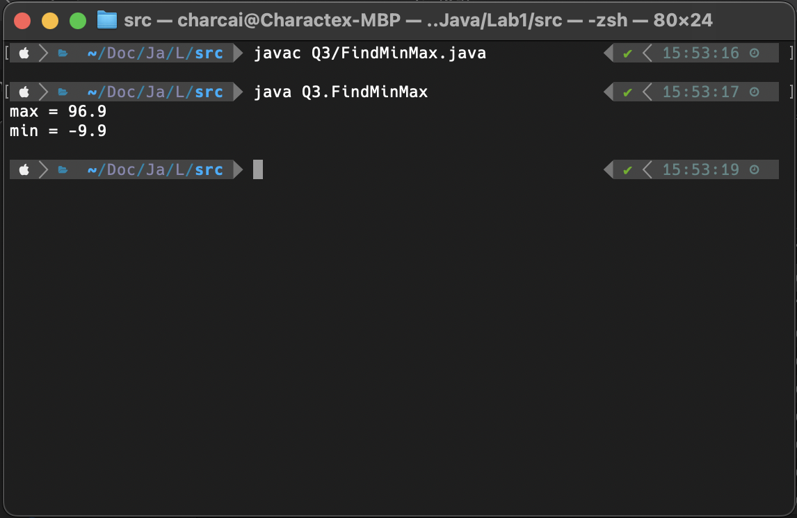
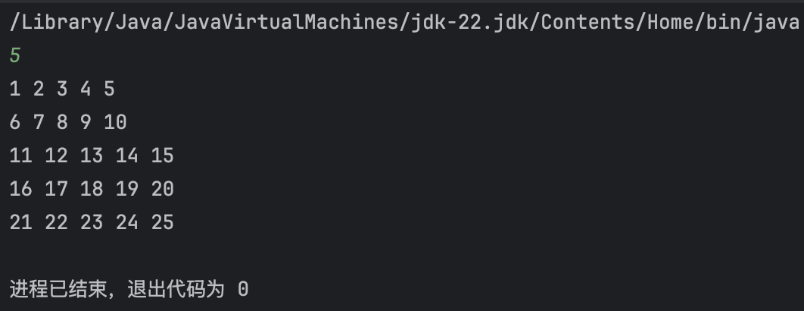
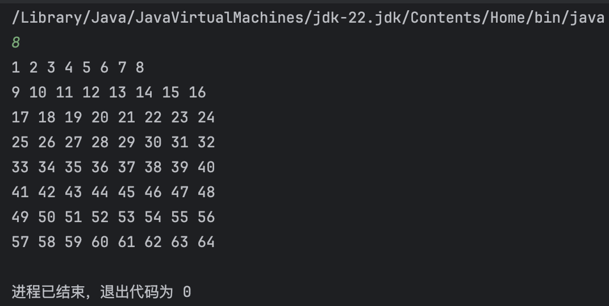
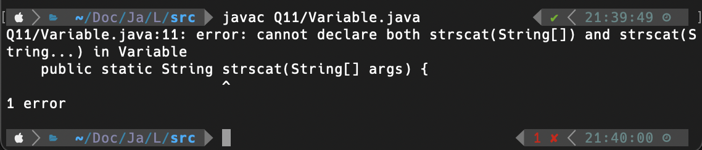
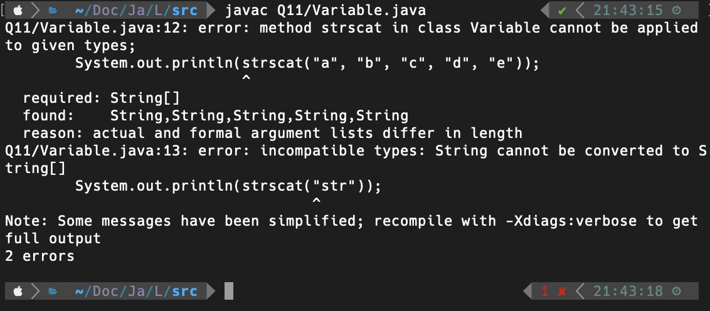
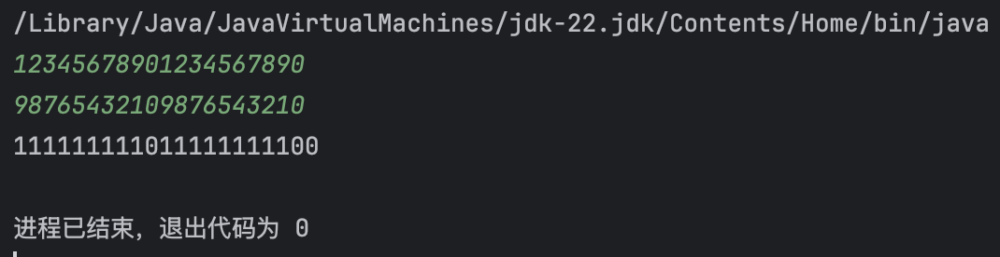

# Lab 01 Assignment

> 班级：232112
>
> 学号：23373381
>
> 姓名：蔡彦恒

## Question 01

包名命名为`Q1`，在命令行使用`javac Q1/Main.java`命令编译，并使用`java Q1.Main`命令运行生成的字节码。



## Question 02

|**基本类型**|**默认值**|**基本类型**|**默认值**|
|:----:|:----:|:----:|:----:|
|**byte**| 0 |**boolean**|	false|
|**short**| 0 |**char**		|	0|
|**int**|	0	|**float**	|0.0|
|**long**|	0	|**double**	|0.0|

代码实现：

```java
public class Main {
    byte b;
    short s;
    int i;
    long l;
    boolean bool;
    char c;
    float f;
    double d;
    public static void main(String[] args) {
        Main m = new Main();
        System.out.println("byte: " + m.b);
        System.out.println("short: " + m.s);
        System.out.println("int: " + m.i);
        System.out.println("long: " + m.l);
        System.out.println("bool: " + m.bool);
        System.out.println("char: " + (int)m.c);
        System.out.println("float: " + m.f);
        System.out.println("double: " + m.d);
    }
}

```

保存在`./Q2/Main.java`。

## Question 03

初步体现了面向对象编程思想，代码实现

```java
public class FindMinMax {
    private static final double d1 = 1, d2 = -9.9, d3 = 96.9;
    public static double max() {
        double tmp;
        tmp = d1 > d2? d1 : d2;
        return (tmp > d3? tmp : d3);
    }
    public static double min() {
        double tmp;
        tmp = d1 < d2? d1 : d2;
        return (tmp < d3? tmp : d3);
    }
    public static void main(String[] args) {
        System.out.println("max = " + max());
        System.out.println("min = " + min());
    }
}
```

保存在`./Q3/FindMinMax.java`，运行结果：



```
max = 96.9
min = -9.9
```
## Question 04

运行结果：

```
1
2
b is false
```

在main方法中，首先执行`test1(0)`，函数打印`1`并返回`0 < 1`的boolean值`true`；

其次执行`test2(2)`，函数打印`2`并返回 `2 < 2` 的boolean值 `false` 。

因为 `test2(2)` 为 `false` ，故 `b = test1(0) && test2(2) && test3(2)` 一定为`false`。由于短路机制的存在，将不会继续运行`test3(2)`函数，故没有在屏幕上输出`3`。

## Question 05

### 1. 上述源文件的名字是什么？

答：`Student.java`

### 2. 编译上述源文件将生成几个字节码文件？这些字节码文件的名字都是什么？

答：生成 2 个字节码文件，文件名分别为`Student.class`与`Exam.class`。

### 3. 执行以下命令并输出结果

#### （1）在命令行执行 `java Student` 得到怎样的错误提示？
```
Error: Main method not found in class Student, please define the main method as:
   public static void main(String[] args)
or a JavaFX application class must extend javafx.application.Application
```
#### （2）执行 `java exam` 得到怎样的错误提示？
```
Error: Could not find or load main class exam
Caused by: java.lang.NoClassDefFoundError: exam (wrong name: Q5/Exam)
```
#### （3）执行 `java Exam.class` 得到怎样的错误提示？
```
Error: Could not find or load main class Exam.class
Caused by: java.lang.ClassNotFoundException: Exam.class
```
#### （4）执行 `java Exam` 得到怎样的输出结果？
```
I am studying Java.
```

## Question 06
代码见`./Q6/TwoDimensionArray.java`

运行结果：
```
b[0][0] = 1000
sum = 1139
b.lengh = 3
 arr1:
0 1 2 3 
4 5 6 7 
8 9 10 11 
 arr2:
0 1 2 
3 4 5 6 
7 8 9 10 11 
 arr3:
0 1 2 
3 4 5 
6 7 8 
```

## Question 07
#### 题设代码：
```java
public class SwitchExample {
    public static void main (String[] args) {
        char c = '\0';
        for(int i = 1; i <= 4; i++) {
            switch (i) {
                case 1:  c = 'J';
                    System.out.print(c);
                case 2:  c = 'e';
                    System.out.print(c);
                    break;
                case 3:  c = 'p';
                    System.out.print(c);
                default: System.out.print("好");
            }
        }
    }
}
```
#### 运行结果：
```
Jeep好好
```
#### 原因分析：

`i = 1`时，`switch-case`语句进入`case 1`，输出`J`；由于没有break语句，继续向下执行，输出`e`，然后break跳出`switch-case`，继续下一轮循环。

`i = 2`时，`switch-case`语句进入`case 2`，输出`e`，之后遇到`break`语句，跳出`switch-case`，继续下一轮循环。

`i = 3`时，`switch-case`语句进入`case 3`，输出`p`；由于没有break语句，继续向下执行`default`的内容，输出`好`。

`i = 4`时，`switch-case`语句进入`default`，输出`好`；之后到达`switch-case`末尾，不再执行。

故输出为`Jeep好好`。

## Question 08
代码见`./Q8/nDimension.java`
```java
import java.util.Scanner;

public class nDimension {
    public static void main(String[] args) {
        Scanner input = new Scanner(System.in);
        int n = input.nextInt();
        int cnt = 0;
        for (int i = 1; i <= n; i++) {
            for(int j = 1; j <= n; j++) {
                System.out.print(++cnt + " ");
            }
            System.out.println();
        }
    }
}
```

- 输入5


- 输入8


## Question 09

代码见`./Q9/sort.java`

```java
public class sort {
    public static int[] qsort(int[] arr) {
        if(arr == null) {
            return null;
        }
        if(arr.length <= 1) {
            return arr;
        }
        int temp;
        for (int j = 0; j < arr.length - 1; j++) {
            for (int i = 0; i < arr.length - 1 - j; i++) {
                if (arr[i] > arr[i + 1]) {
                    temp = arr[i];
                    arr[i] = arr[i + 1];
                    arr[i + 1] = temp;
                }
            }
        }
        return arr;
    }
    public static void main(String[] args) {
        int[] arr = new int[]{1, 3, 5, 7, 9, 2, 4, 6, 8};
        qsort(arr);
        for (int j : arr) {
            System.out.print(j + " ");
        }
    }
}
```

## Question 10

#### (1) 指出代码中注释标注出的四行输出的内容会是什么
1. p1 的 x, y 坐标: 1111, 2222
2. p2 的 x, y 坐标: -100, -200
3. p1 的 x, y 坐标: 0, 0
4. p2 的 x, y 坐标: 0, 0

#### (2) 什么是浅拷贝？什么是深拷贝？请你查阅一些资料，并给出你的资讯。

- 浅拷贝是指创建一个新对象，这个新对象的字段包含了原对象字段的精确副本，若字段是引用类型则复制地址，故对引用对象的操作会影响原对象。

- 浅拷贝是指创建一个新对象，递归地复制所有引用类型字段所引用的对象。即使字段是引用类型，也会创建一个新副本，对其所有更改均不会影响原来的对象。

#### (3) 如果你要为一个类实现 copy() 方法，思考如何避免引用间赋值导致的浅拷贝？或者说，如何确保进行的是深拷贝。

可以在类中定义一个复制构造函数，通过该构造函数手动复制所有引用类型字段。

#### 解释String的 == 和 equals() 的区别。

- `==`仅检查引用的地址是否相同，即它们是否指向同一个对象；

- `equals()`检查字符串内容是否相同。

## Question 11

代码见`./Q11/Variable.java`

```java
package Q11;

public class Variable {
    public static String strscat(String... args) {
        String ss = "";
        for(String x : args) {
            ss = ss + x;
        }
        return ss;
    }
    public static void main(String[] args) {
        System.out.println(strscat("a", "b", "c", "d", "e"));
        System.out.println(strscat("str"));
    }
}
```

#### (1) 尝试理解 Java 可变参数的实现机制，说说你的想法。

可变参数实际上是将参数自动打包作为数组传递给方法。

#### (2) 调用 strscat(new String[]{"a", "b"}) 能通过编译吗？为什么？

可以。本质上即手动将可变个参数打包为参数数组传递给方法。

#### (3) 如果还有静态方法 String strscat(String[] args) 同时存在，代码能通过编译吗？给出 IDE 的编译结果的截图。

不能通过编译。



#### (4) 如果我们声明的是 String strscat(String[] args)，strscat("a", "b", "c") 这样的调用还能通过编译吗？给出 IDE 的编译结果的截图。



## Question 12

样例运行结果：



代码见`./Q12/BigNumberAddition.java`

```java
package Q12;

import java.math.BigInteger;
import java.util.Scanner;

public class BigNumberAddition {
    public static void main(String[] args) {
        Scanner scanner = new Scanner(System.in);
        BigInteger a = scanner.nextBigInteger();
        BigInteger b = scanner.nextBigInteger();


        // 计算它们的和
        BigInteger sum = a.add(b);

        // 输出结果
        System.out.println(sum);
    }
}
```

## Question 13

代码见`./Q13/Test.java`

```java
package Q13;
class buyer {
    private String name;
    public buyer(String name) {
        this.name = name;
    }
    public void buy(String thing) {
        System.out.println(name + " 买了 " + thing);
    }
}
class chef {
    private String name;
    public chef(String name) {
        this.name = name;
    }
    public void cook(String thing) {
        System.out.println(name + " 做好了 " + thing);
    }
}

public class Test {
    public static void main(String[] args) {
        buyer aunt = new buyer("姑姑");
        buyer mom = new buyer("妈妈");
        buyer self = new buyer("自己");

        chef dad = new chef("爸爸");
        chef auntie = new chef("婶婶");

        aunt.buy("鱼");
        mom.buy("羊肉");
        self.buy("蔬菜");

        dad.cook("葱爆羊肉");
        auntie.cook("豆腐鱼汤");
    }
}
```