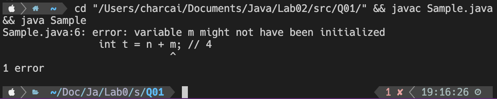

# Lab 02 Assignment

> 班级：232112
>
> 学号：23373381
>
> 姓名：蔡彦恒

## Question 01

#### 1. 注释标记的哪些行会导致编译错误？**将错误截图，并说明原因**。

第 4 行会编译错误。



在方法中声明的变量需手动设置初始值后方可正常调用，此处 `m` 没有赋初始值。

#### 2. 区分变量 `x` 和 `m` ，**回答谁需要初始化才能使用，为什么**

- `m`需要初始化才能使用，因为它是声明在方法中的局部变量。

- `x`不需初始化即可使用，因为它是声明在类中的全局变量。

## Question 02

#### a. `Overload(int m)` 与 `Overload(double m)` 互为重载的构造方法。

**正确。**

#### b. `int Overload(int m)` 与 `void Overload(double m)` 互为重载的非构造方法。

**正确。**

#### c. `Overload` 类有 2 个构造方法，尝试调用默认构造方法 `Overload()` 会无法通过编译。

**正确。**

#### d. `Overload` 类有 3 个构造方法。

**错误**。构造方法无返回值类型，只有前两个方法是合法的构造方法。

## Question 03

输出：

```
initialize A1
initialize A2
initialize A3
initialize A4
initialize A5
initialize A6
copy from A6
initialize B1
initialize A8
main begins
initialize A9
initialize A6
copy from A6
initialize B2
initialize A8
main ends
```

## Question 04

#### 1. 这段代码能够证明“在属性定义处初始化的属性，比在方法中初始化的属性先被初始化”吗？

**能。** `a7`在属性定义处初始化，`a8`在方法中初始化，尽管`a7`出现于`a8`之后，依然被先初始化。

#### 2. 这段代码能够证明“在属性定义处初始化的属性，初始化顺序等同于他们在类定义
中出现的顺序”吗？

**能。** `a6`、`a7`两个非静态属性先后出现，二者也是按照出现顺序先后被初始化。

## Question 05

静态属性的初始化顺序均与出现顺序相同，无论是静态变量还是静态初始化块。

1. **静态变量** 静态变量在类加载时初始化。它们按照在类中出现的顺序进行初始化。
2. **静态初始化块** 静态初始化块在静态变量初始化同时执行。多个静态初始化块按照它们在类中出现的顺序依次执行。

`a3`, `a4`, `a5`中，`a3`，`a5`是静态变量、`a4`在静态初始化块中被初始化，三者均按照出现顺序`a3` - `a4` - `a5`被初始化。

## Question 06

#### 1. 这段代码能够证明“在类的实例第一次被构造、或类的静态属性和静态方法第一次被访问时，JVM 会执行类加载”吗？如果不能，请尝试修改代码并证明。

**不能。** 需要在每个类的起始处打印执行的提示信息，修改后的代码如下：

```java
class A {
	static {
		System.out.println("Class A is being loaded");
	}
	int value;
	static A a1 = new A(1);
	public A(int i) {
		System.out.println("initialize A" + i);
		value = i;
	}
	public A(A a) {
		System.out.println("copy from A" + a.value);
		value = a.value;
	}
	static A a2 = new A(2);
}

class B {
	static {
		System.out.println("Class B is being loaded");
	}
	A a8;
	// A a7 = new A(a6);
	A a6 = new A(6);
	static A a3 = new A(3);
	static A a4;
	static {
		a4 = new A(4);
	}
	static A a5 = new A(5);
	public B(int i) {
		System.out.println("initialize B" + i);
		a8 = new A(8);
	}
	A a7 = new A(a6);
}

public class Initialization {
	static {
		System.out.println("Class Initialization is being loaded");
	}
	static B b1 = new B(1);
	static B b2;
	public static void main(String[] args) {
		System.out.println("main begins");
		A a9 = new A(9);
		b2 = new B(2);
		System.out.println("main ends");
	}
}
```

该程序编译运行后输出结果：

```
Class Initialization is being loaded
Class B is being loaded
Class A is being loaded
initialize A1
initialize A2
initialize A3
initialize A4
initialize A5
initialize A6
copy from A6
initialize B1
initialize A8
main begins
initialize A9
initialize A6
copy from A6
initialize B2
initialize A8
main ends
```
由前三行可知，类被加载的顺序是`Initialization`, `B`, `A`, 与三者第一次被加载的顺序一致，故可以证明“在类的实例第一次被构造、或类的静态属性和静态方法第一次被访问时，JVM 会执行类加载”。

#### 2. 基于`static`关键字，带有`static`关键字的方法、变量、代码块可以调用什么？反过来，不带有`static`关键字的方法、变量、代码块可以调用什么？(带有`static`关键字的方法、变量 or 不带有`static`关键字的方法、变量 or 都可以)

- 带有`static`关键字的方法、变量、代码块只能调用其他带有`static`关键字的方法、变量、代码块。

- 不带有`static`关键字的方法、变量、代码块可以调用带有`static`关键字的方法、变量、代码块，也可以调用其他不带`static`关键字的方法、变量、代码块。

## Question 07

不可以，其他的外部类不能通过 `new Singleton()` 来构造一个新的 `Singleton` 变量。

## Question 08

- 因为 `Singleton` 类的构造方法是私有的，此类只能在 `Singleton` 类的内部被调用。外部类无法访问这个私有构造方法，因此无法创造更多实例，最多只可能有由 `Singleton` 类自己创造的 1 个实例同时存在。

- 唯一实例在第一次调用 `getInstance()` 方法时被构造。

## Question 09

下列代码可以从外部调用 `Singleton` 类的 `foo()`：

```java
public class TestSingleton {
    public static void main(String[] args) {
        // 获取 Singleton 类的唯一实例
        Singleton singletonInstance = Singleton.getInstance();
        
        // 调用 Singleton 类的 foo() 方法
        singletonInstance.foo();
    }
}
```

## Question 10

代码见`./Q10/TestPerson.java`

- 目录名为：`Q10`
- 文件名：`TestPerson.java`

## Question 11

代码见`./Q11/Solution.java`

- 目录名为：`Q11`
- 文件名：`Solution.java`