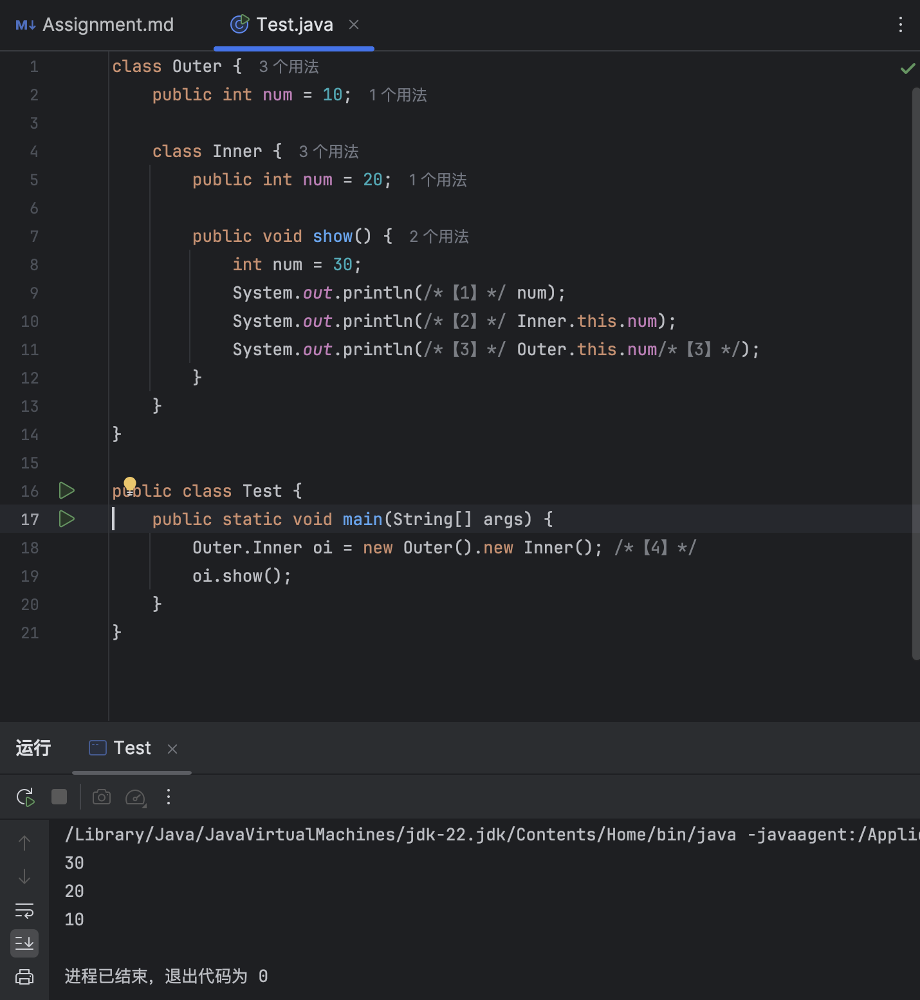
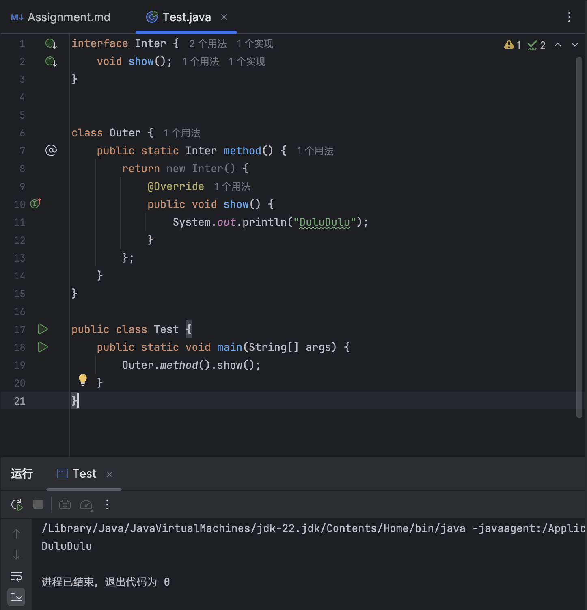

# Lab 04 Assignment

> 班级 232112
> 
> 学号 23373381
> 
> 姓名 蔡彦恒

## Question 1

- 运行 `Test` 的 `main 方法，程序的输出是什么？
  - `private f()`
- 如果将父类中的方法声明为 `public`，而子类为 `private`，编译能通过吗？如果能，最后会输出什么？
  - 编译不能通过，因为子类的方法的访问权限不能低于父类被重写的方法的访问权限。

## Question 2

- 运行 `Test` 的 `main` 方法，程序的输出是什么？
```
sup.field = 0, sup.getField() = 1
sub.field = 1, sub.getField() = 1, sub.getSuperField() = 0
```
- 类的非静态属性能体现多态性吗？
  - 能，因为非静态属性是动态绑定的。

## Question 3

- 运行 `Test` 的 `main` 方法，程序的输出是什么？
```
Base staticGet()
Derived dynamicGet()
```
- 类的静态属性和静态方法能体现多态性吗？
  - 不能，因为静态属性和静态方法属于类，不属于对象。

## Question 4

- 程序可以编译通过吗？如果不可以的话需要怎么改动，为什么？
  - 不可以。应将第14行 `parent.study()` 改为 `child.study()`。`study()` 方法是在 `Child` 子类中定义的，`parent` 对象无法调用 `study()` 方法。
- 程序的正确输出是什么？
```
parent.name=李四
child.name=张三
子类eating
父类sleeping
子类eating
子类sleeping
子类studying
```
- 给出程序这样输出的解释。
  - `Child` 类中的 `eat()` 方法重写了 `Parent` 类中的 `eat()` 方法。子类同名的非静态方法覆盖父类，调用 `parent` 的方法找的是子类的方法。

## Question 5

工程文件见 `./Question5` 目录。

## Question 6



## Question 7



## Question 8

工程文件见 `./Question8` 目录，测试类为 `src` 目录下的 `Test.java`。

> 测试说明：充分利用已实现的方法，生成指定个数的随机Shape，利用 `ShapeSequence` 类进行储存、计算，利用迭代器 `SequenceIterator` 进行遍历，输出形状序列、各自的面积。

